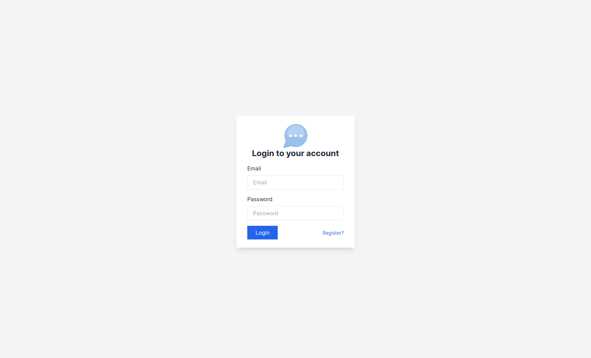
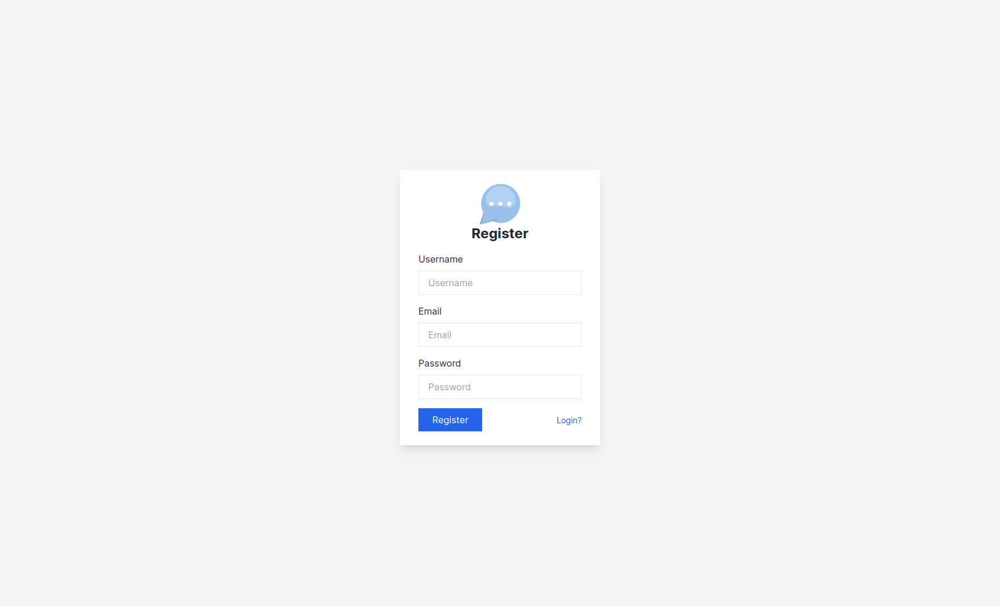
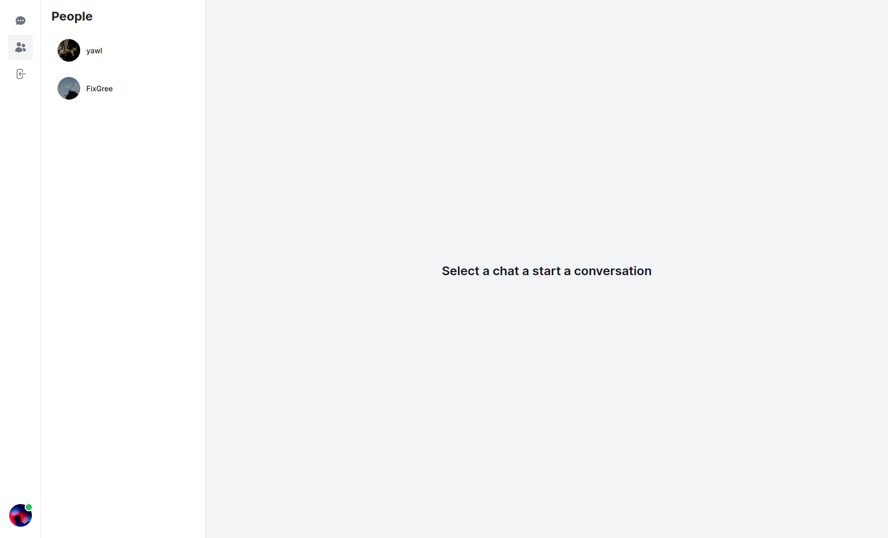
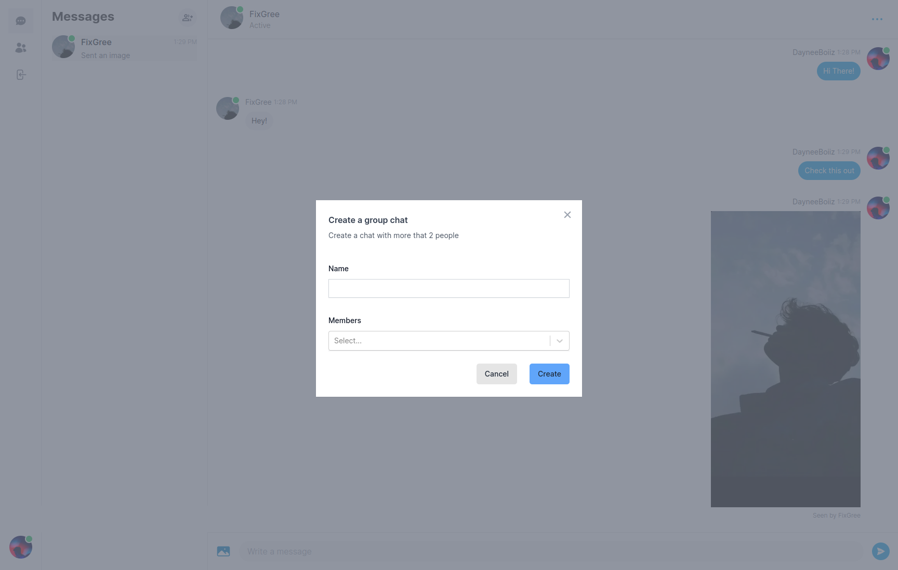
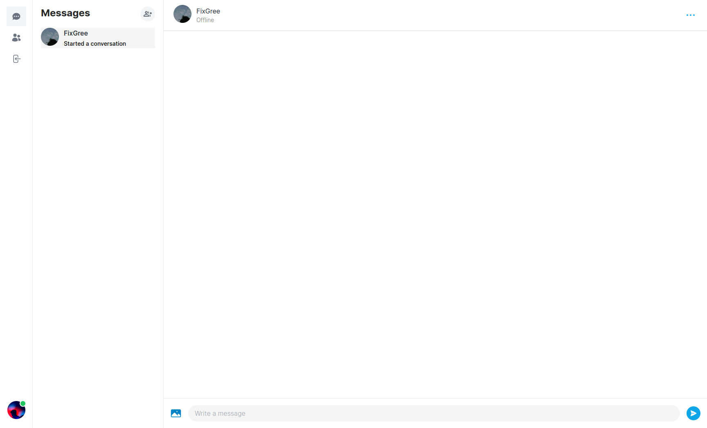
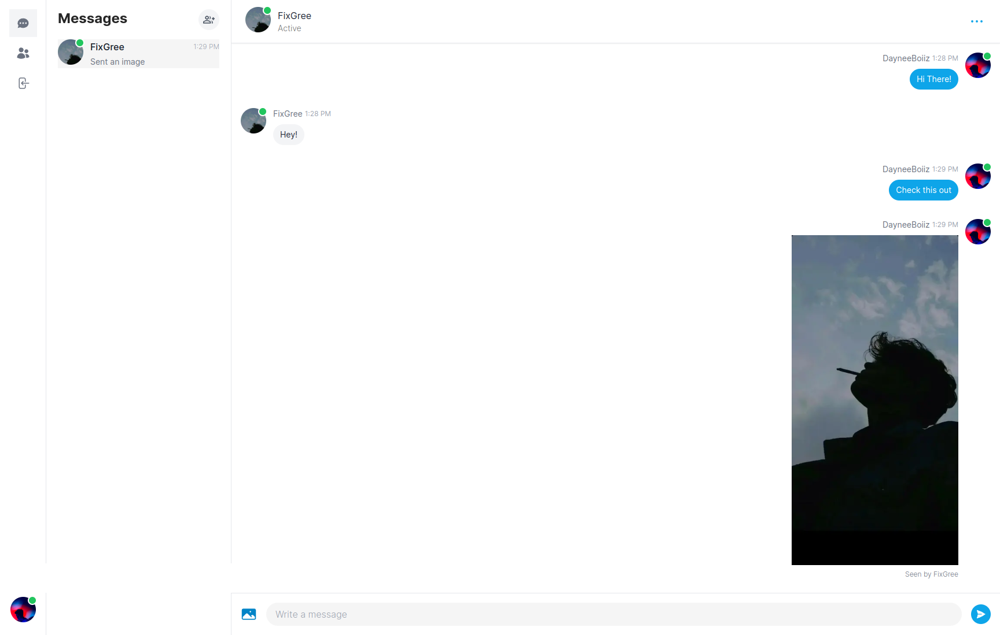
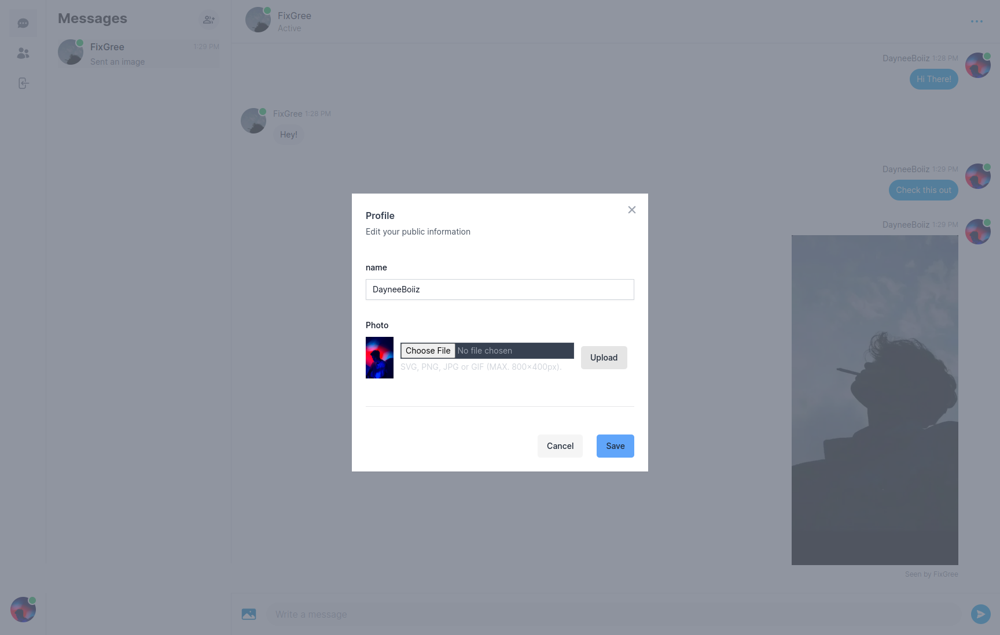

# Frontend Messenger Clone

A real-time messenger application built with Next.js 13 and TypeScript.

## Table of Contents

- [Description](#description)
- [Screenshots](#screenshots)
- [Libraries Used](#libraries-used)
- [Installation](#installation)
- [Usage](#usage)

## Description

This project is a real-time messenger clone that provides a modern and responsive user interface for messaging. It's built using Next.js 13 and TypeScript, making it efficient and type-safe.

## Screenshots









## Libraries Used

This project utilizes several libraries to enhance functionality and maintain code quality:

- [Headless UI](https://github.com/tailwindlabs/headlessui) - A set of completely unstyled, fully accessible UI components.
- [Radix UI](https://github.com/radix-ui/react-slot) - A set of low-level UI primitives for React.
- [@tailwindcss/forms](https://github.com/tailwindlabs/tailwindcss-forms) - Adds additional utility classes for form elements in Tailwind CSS.
- [@tanstack/react-query](https://github.com/tannerlinsley/react-query) - A data-fetching library for React applications.
- [Axios](https://github.com/axios/axios) - A promise-based HTTP client for the browser and Node.js.
- [Class Variance Authority](https://github.com/timothykemp/cla-variance-authority) - A JavaScript implementation of CVAR.
- [clsx](https://github.com/lukeed/clsx) - A tiny utility for constructing className strings conditionally.
- [cookie](https://github.com/jshttp/cookie) - A tiny, fast JavaScript cookie library.
- [date-fns](https://github.com/date-fns/date-fns) - Modern JavaScript date utility library.
- [ESLint](https://eslint.org/) - A pluggable and configurable linter tool for identifying and fixing problems in JavaScript code.
- [Eslint-config-next](https://github.com/vercel/eslint-config-next) - ESLint configuration for Next.js projects.
- [js-cookie](https://github.com/js-cookie/js-cookie) - A simple, lightweight JavaScript API for handling cookies.
- [lodash](https://lodash.com/) - A modern JavaScript utility library delivering modularity, performance, and extras.
- [Lucide React](https://github.com/lucide-icons/lucide) - A set of 140+ SVG icons for your web projects.
- [Next.js](https://nextjs.org/) - A React framework with built-in server rendering and routing.
- [Next Cloudinary](https://github.com/jaydubb12/next-cloudinary) - A library for optimizing and serving images from Cloudinary in Next.js.
- [Prisma](https://github.com/prisma/prisma) - A modern database toolkit for TypeScript and Node.js.
- [Pusher.js](https://github.com/pusher/pusher-js) - JavaScript library for interacting with the Pusher Channels HTTP API.
- [React](https://reactjs.org/) - A JavaScript library for building user interfaces.
- [React Hook Form](https://react-hook-form.com/) - A library for managing form state and validation in React.
- [React Icons](https://react-icons.github.io/react-icons/) - Popular icons library for React applications.
- [React Select](https://react-select.com/) - A flexible and customizable select component for React.
- [React Spinners](https://github.com/davidhu2000/react-spinners) - A collection of loading spinner components for React.
- [Tailwind Merge](https://github.com/benface/tailwind-merge) - Tailwind CSS plugin for merging utilities.
- [Tailwind CSS Animate](https://github.com/benface/tailwindcss-animate) - A plugin for animating elements with Tailwind CSS.
- [TypeScript](https://www.typescriptlang.org/) - A typed superset of JavaScript that compiles to plain JavaScript.
- [Zustand](https://github.com/pmndrs/zustand) - A small, fast, and scaleable state management library for React.

## Installation

To get started with this project, follow these steps:

1. Clone the repository:

   ```bash
   git clone https://github.com/yourusername/frontend-messenger-clone.git
   ```

2. Configure environment variables, database connection, and any other necessary configurations.

3. Start the development server:

   ```bash
   npm run dev
   ```

4. Open your browser and navigate to http://localhost:3000 to view the application.

## Usage

- Sign in or create an account to start using the messenger.
- Send and receive real-time messages with friends and contacts.
- Customize your profile and settings.

## Features

- Real-time messaging
- User authentication
- Profile customization
- Responsive design
